---
# Front matter
lang: ru-RU
title: "Шаблон отчёта по лабораторной работе №10"
subtitle: "1022204143"
author: "Надиа Эззакат"

# Formatting
toc-title: "Содержание"
toc: true # Table of contents
toc_depth: 2
lof: true # List of figures
lot: true # List of tables
fontsize: 12pt
linestretch: 1.5
papersize: a4paper
documentclass: scrreprt
polyglossia-lang: russian
polyglossia-otherlangs: english
mainfont: PT Serif
romanfont: PT Serif
sansfont: PT Sans
monofont: PT Mono
mainfontoptions: Ligatures=TeX
romanfontoptions: Ligatures=TeX
sansfontoptions: Ligatures=TeX,Scale=MatchLowercase
monofontoptions: Scale=MatchLowercase
indent: true
pdf-engine: lualatex
header-includes:
  - \linepenalty=10 # the penalty added to the badness of each line within a paragraph (no associated penalty node) Increasing the value makes tex try to have fewer lines in the paragraph.
  - \interlinepenalty=0 # value of the penalty (node) added after each line of a paragraph.
  - \hyphenpenalty=50 # the penalty for line breaking at an automatically inserted hyphen
  - \exhyphenpenalty=50 # the penalty for line breaking at an explicit hyphen
  - \binoppenalty=700 # the penalty for breaking a line at a binary operator
  - \relpenalty=500 # the penalty for breaking a line at a relation
  - \clubpenalty=150 # extra penalty for breaking after first line of a paragraph
  - \widowpenalty=150 # extra penalty for breaking before last line of a paragraph
  - \displaywidowpenalty=50 # extra penalty for breaking before last line before a display math
  - \brokenpenalty=100 # extra penalty for page breaking after a hyphenated line
  - \predisplaypenalty=10000 # penalty for breaking before a display
  - \postdisplaypenalty=0 # penalty for breaking after a display
  - \floatingpenalty = 20000 # penalty for splitting an insertion (can only be split footnote in standard LaTeX)
  - \raggedbottom # or \flushbottom
  - \usepackage{float} # keep figures where there are in the text
  - \floatplacement{figure}{H} # keep figures where there are in the text
---

# Цель работы

Познакомиться с операционной системой Linux. Получить практические навыки работы с редактором Emacs.

# Задание

1. Открыть emacs.

2. Создать файл lab07.sh с помощью комбинации Ctrl-x Ctrl-f (C-x C-f).

3. Наберите текст: #!/bin/bash HELL=Hello function hello { LOCAL HELLO=World echo $HELLO } echo $HELLO hello

4. Сохранить файл с помощью комбинации Ctrl-x Ctrl-s (C-x C-s).

5. Проделать с текстом стандартные процедуры редактирования, каждое действие должно осуществляться комбинацией клавиш.

5.1. Вырезать одной командой целую строку (С-k).

5.2. Вставить эту строку в конец файла (C-y).

5.3. Выделить область текста (C-space).

5.4. Скопировать область в буфер обмена (M-w).

5.5. Вставить область в конец файла.

5.6. Вновь выделить эту область и на этот раз вырезать её (C-w).

5.7. Отмените последнее действие (C-/).

6. Научитесь использовать команды по перемещению курсора.

6.1. Переместите курсор в начало строки (C-a).

6.2. Переместите курсор в конец строки (C-e).

6.3. Переместите курсор в начало буфера (M-<).

6.4. Переместите курсор в конец буфера (M->).

7. Управление буферами.

7.1. Вывести список активных буферов на экран (C-x C-b).

7.2. Переместитесь во вновь открытое окно (C-x) o со списком открытых буферов и переключитесь на другой буфер.

7.3. Закройте это окно (C-x 0).

7.4. Теперь вновь переключайтесь между буферами, но уже без вывода их списка на экран (C-x b).

8. Управление окнами.

8.1. Поделите фрейм на 4 части: разделите фрейм на два окна по вертикали (C-x 3), а затем каждое из этих окон на две части по горизонтали (C-x 2)

8.2. В каждом из четырёх созданных окон откройте новый буфер (файл) и введите несколько строк текста.

9. Режим поиска

9.1. Переключитесь в режим поиска (C-s) и найдите несколько слов, присутствующих в тексте.

9.2. Переключайтесь между результатами поиска, нажимая C-s.

9.3. Выйдите из режима поиска, нажав C-g.

9.4. Перейдите в режим поиска и замены (M-%), введите текст, который следует найти и заменить, нажмите Enter , затем введите текст для замены. После того как будут подсвечены результаты поиска, нажмите ! для подтверждения замены.

9.5. Испробуйте другой режим поиска, нажав M-s o. Объясните, чем он отличается от обычного режима?

# Выполнение лабораторной работы

1. Открылa emacs.

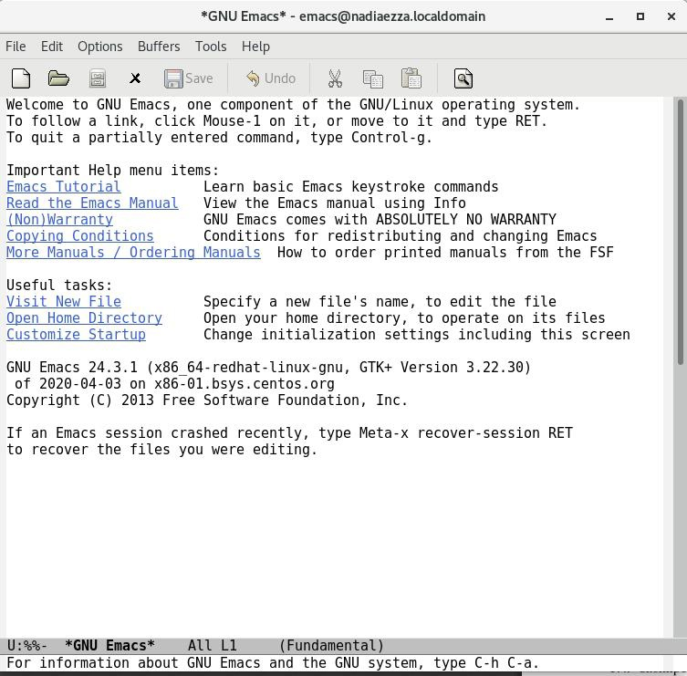

2. Создалa файл lab07.sh с помощью комбинации Ctrl-x Ctrl-f (C-x C-f).

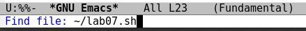

3. Набралa текст

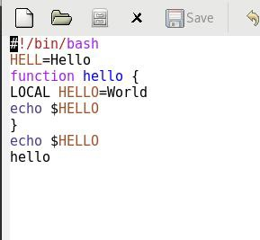

4. Сохранилa файл с помощью комбинации Ctrl-x Ctrl-s (C-x C-s).

5. Проделать с текстом стандартные процедуры редактирования, каждое действие должно осуществляться комбинацией клавиш.

5.1. Вырезалa одной командой целую строку (С-k).

5.2. Вставилa эту строку в конец файла (C-y).

5.3. Выделилa область текста (C-space).

5.4. Скопировалa область в буфер обмена (M-w).

5.5. Вставилa область в конец файла.

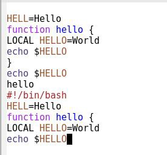

5.6. Вновь выделить эту область и на этот раз вырезать её (C-w).

5.7. Отменилa последнее действие (C-/).

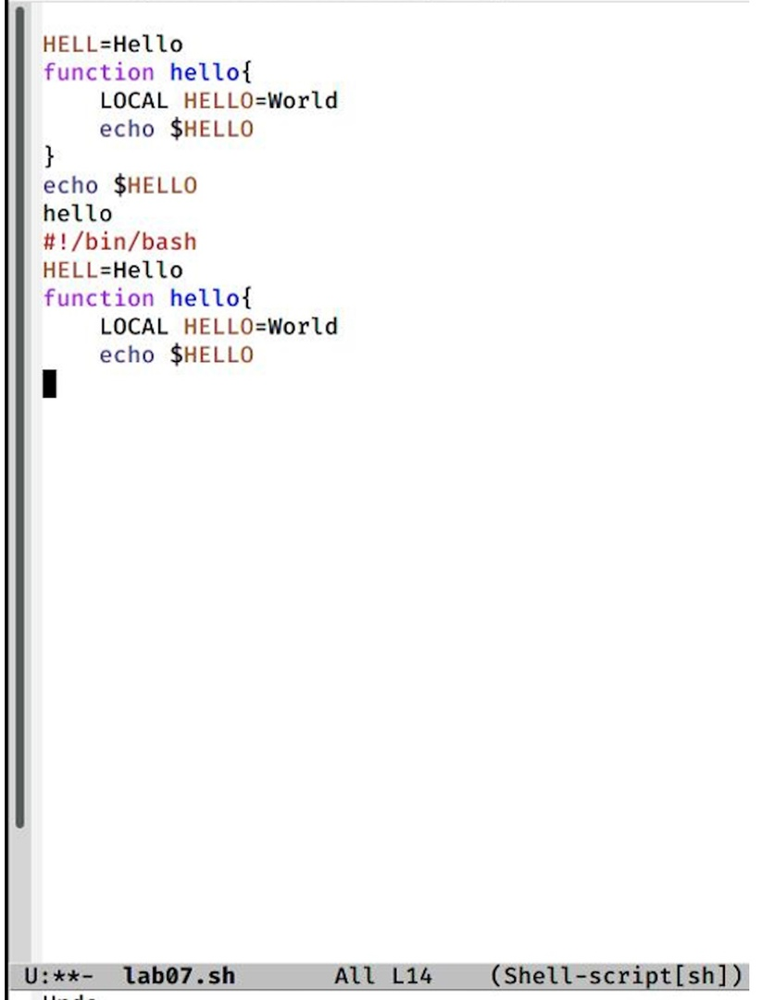

6. Научитесь использовать команды по перемещению курсора.

6.1. Переместилa курсор в начало строки (C-a).

6.2. Переместил курсор в конец строки (C-e).

6.3. Переместилaa курсор в начало буфера (M-<).

6.4. Переместилa курсор в конец буфера (M->).

7. Управление буферами.

7.1. Вывелa список активных буферов на экран (C-x C-b)

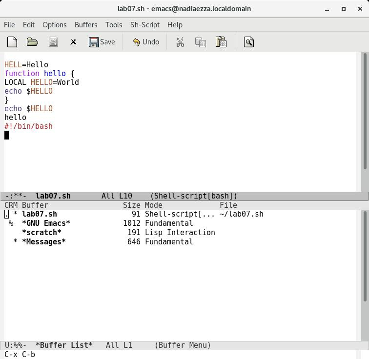

7.2. Переместился во вновь открытое окно (C-x) o со списком открытых буферов и переключитесь на другой буфер.

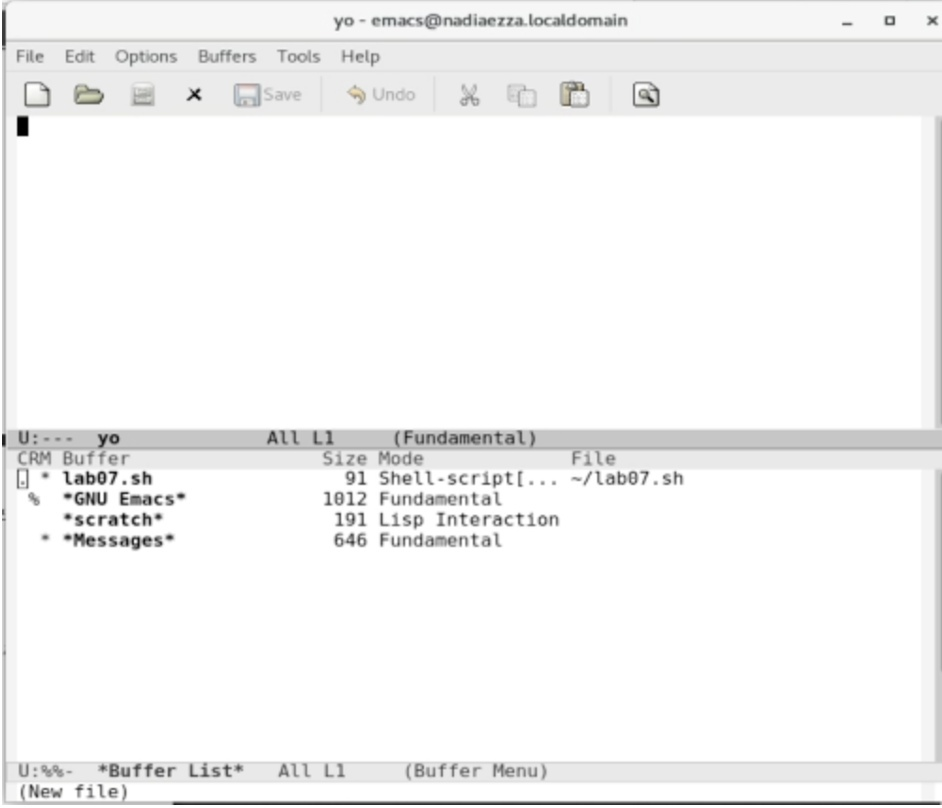

7.3. Закрылa это окно (C-x 0).

7.4. Теперь вновь переключайтесь между буферами, но уже без вывода их списка на экран (C-x b).

8. Управление окнами.

8.1. Поделилa фрейм на 4 части: разделите фрейм на два окна по вертикали(C-x 3), а затем каждое из этих окон на две части по горизонтали (C-x 2)

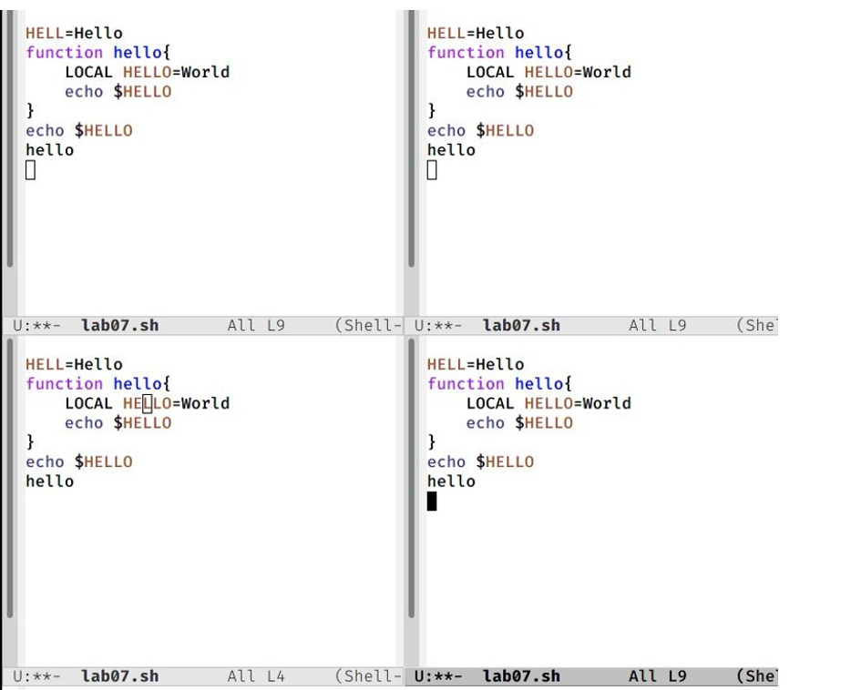

8.2. В каждом из четырёх созданных окон открыл новый буфер (файл) и ввел несколько строк текста

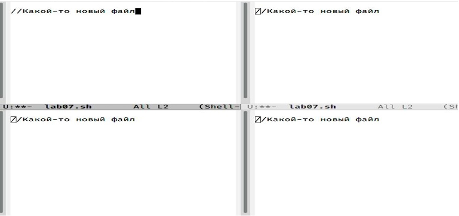

9. Режим поиска 

9.1. Переключилaсь в режим поиска (C-s) и нашел несколько слов, присутствующих в тексте.

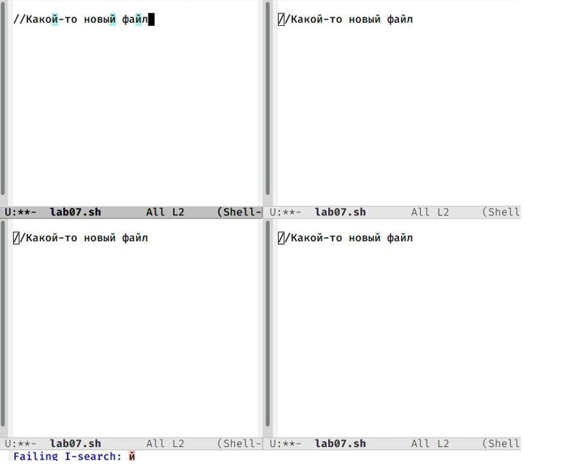

9.2. Переключилaсь между результатами поиска, нажимая C-s.

9.3. Вышелa из режима поиска, нажав C-g.

9.4. Перешелa в режим поиска и замены (M-%), ввел текст, который следует найти и заменить, нажимал Enter , затем ввел текст для замены. После того как будут 
подсвечены результаты поиска, нажмите ! для подтверждения замены.

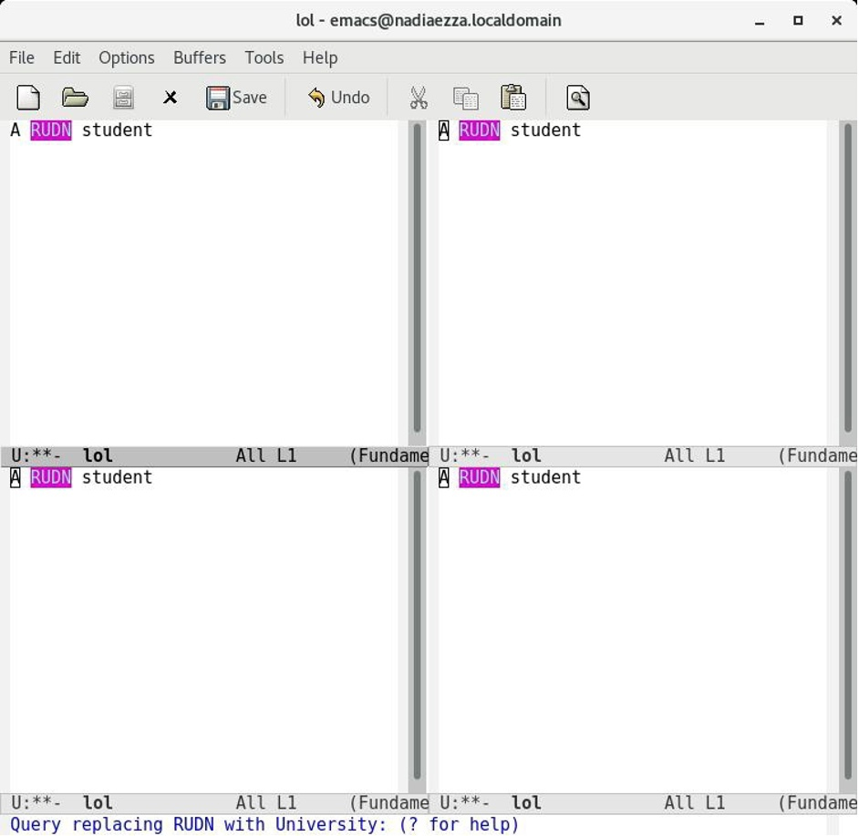

9.5. Испробовалa другой режим поиска, нажав M-s o. Объясните, чем он отличается от обычного режима? M-s сразу перешелa к тому месту, где находится ввденное слово

# Контрольные вопросы

1. Emacs представляет собой мощный экранный редактор текста, написанный на языке высокого уровня Elisp.

2. Буфер — объект, представляющий какой-либо текст. Окно — прямоугольная область фрейма, отображающая один из буферов.

3. Emacs использует буферы с именами, начинающимися с пробела, для внутренних целей. Отчасти он обращается с буферами с такими

именами особенным образом – например, по умолчанию в них не записывается информация для отмены изменений

4. Ctrl + c, а потом | и Ctrl + c Ctrl + |

5. Разделите фрейм на два окна по вертикали(C-x 3), а затем каждое из этих окон на две части по горизонтали (C-x 2).

6. Настройки emacs хранятся в файле . emacs, который хранится в домашней дирректории пользователя. Кроме этого файла есть ещё папка . emacs.

# Выводы

Познакомился с операционной системой Linux. Получил практические навыки работы с редактором Emacs
