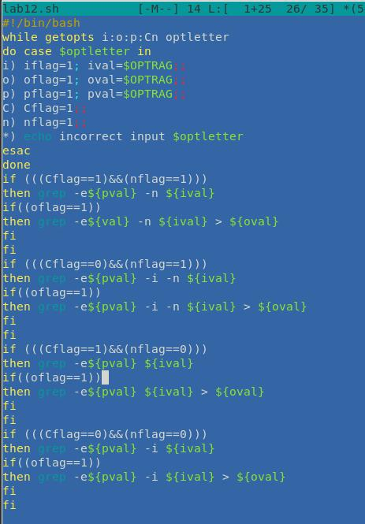
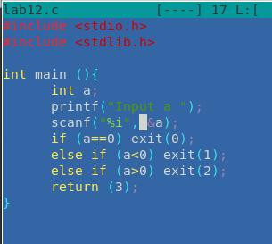
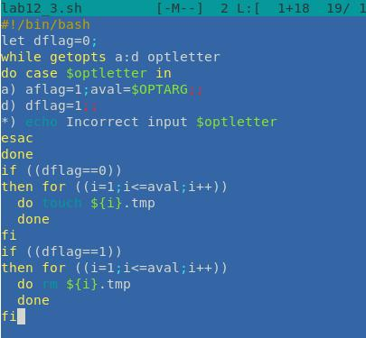
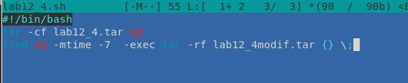

---
## Front matter
lang: ru-RU
title: Презентация по лабораторной работе № 11
author: |
	Эззакат Надиа 
institute: |
	Российский Университет Дужбы Народов
date: Москва, 2021

## Formatting
toc: false
slide_level: 2
theme: metropolis
header-includes: 
 - \metroset{progressbar=frametitle,sectionpage=progressbar,numbering=fraction}
 - '\makeatletter'
 - '\beamer@ignorenonframefalse'
 - '\makeatother'
aspectratio: 43
section-titles: true
---

## Цель Работы

Изучить основы программирования в оболочке ОС UNIX. Научится писать более сложные командные файлы с использованием логических управляющих конструкций и циклов.

## Задача

1. Используя команды getopts grep, написать командный файл, который анализирует командную строку с ключами:
– -``i``inputfile — прочитать данные из указанного файла;
– -``o``outputfile — вывести данные в указанный файл;
– -``p``шаблон — указать шаблон для поиска;
– -``C`` — различать большие и малые буквы;
– -``n`` — выдавать номера строк.
а затем ищет в указанном файле нужные строки, определяемые ключом -p.
2. Написать на языке Си программу, которая вводит число и определяет, является
ли оно больше нуля, меньше нуля или равно нулю. Затем программа завершается
с помощью функции exit(n), передавая информацию в о коде завершения в
оболочку. Командный файл должен вызывать эту программу и, проанализировав
с помощью команды $?, выдать сообщение о том, какое число было введено.
3. Написать командный файл, создающий указанное число файлов, пронумерованных последовательно от 1 до N (например 1.tmp, 2.tmp, 3.tmp,4.tmp и т.д.).
Число файлов, которые необходимо создать, передаётся в аргументы командной
строки. Этот же командный файл должен уметь удалять все созданные им файлы
(если они существуют).
4. Написать командный файл, который с помощью команды tar запаковывает в
архив все файлы в указанной директории. Модифицировать его так, чтобы запаковывались только те файлы, которые были изменены менее недели тому назад
(использовать команду find).

## Выполнение Работы

 

## Вывод

В ходе выполнения этой лабораторной работы. Я узнала больше об использовании редакторов. И почти без труда я успешно выполнила все упражнения

# Спасибо за внимание
