---
# Front matter
lang: ru-RU
title: "Шаблон отчёта по лабораторной работе № 14"
subtitle: "1022204143"
author: "Надиа Эззакат"

# Formatting
toc-title: "Содержание"
toc: true # Table of contents
toc_depth: 2
lof: true # List of figures
lot: true # List of tables
fontsize: 12pt
linestretch: 1.5
papersize: a4paper
documentclass: scrreprt
polyglossia-lang: russian
polyglossia-otherlangs: english
mainfont: PT Serif
romanfont: PT Serif
sansfont: PT Sans
monofont: PT Mono
mainfontoptions: Ligatures=TeX
romanfontoptions: Ligatures=TeX
sansfontoptions: Ligatures=TeX,Scale=MatchLowercase
monofontoptions: Scale=MatchLowercase
indent: true
pdf-engine: lualatex
header-includes:
  - \linepenalty=10 # the penalty added to the badness of each line within a paragraph (no associated penalty node) Increasing the value makes tex try to have fewer lines in the paragraph.
  - \interlinepenalty=0 # value of the penalty (node) added after each line of a paragraph.
  - \hyphenpenalty=50 # the penalty for line breaking at an automatically inserted hyphen
  - \exhyphenpenalty=50 # the penalty for line breaking at an explicit hyphen
  - \binoppenalty=700 # the penalty for breaking a line at a binary operator
  - \relpenalty=500 # the penalty for breaking a line at a relation
  - \clubpenalty=150 # extra penalty for breaking after first line of a paragraph
  - \widowpenalty=150 # extra penalty for breaking before last line of a paragraph
  - \displaywidowpenalty=50 # extra penalty for breaking before last line before a display math
  - \brokenpenalty=100 # extra penalty for page breaking after a hyphenated line
  - \predisplaypenalty=10000 # penalty for breaking before a display
  - \postdisplaypenalty=0 # penalty for breaking after a display
  - \floatingpenalty = 20000 # penalty for splitting an insertion (can only be split footnote in standard LaTeX)
  - \raggedbottom # or \flushbottom
  - \usepackage{float} # keep figures where there are in the text
  - \floatplacement{figure}{H} # keep figures where there are in the text
---

# Цель работы

Приобрести простейшие навыки разработки, анализа, тестирования и отладки приложений в ОС типа UNIX/Linux на примере создания на языке программирования С калькулятора с простейшими функциями.

# Задание

# Задание

1. В домашнем каталоге создайте подкаталог ~/work/os/lab_prog.

2. Создайте в нём файлы: calculate.h, calculate.c, main.c. Это будет примитивнейший калькулятор, способный складывать, вычитать, умножать и делить, возводить число в степень, брать квадратный корень, вычислять sin, cos, tan. При запуске он будет запрашивать первое число, операцию, второе число. После этого программа выведет результат и остановится.
Реализация функций калькулятора в файле calculate.h:
////////////////////////////////////
// calculate.c
 #include <stdio.h>
 #include <math.h>
 #include <string.h>
 #include "calculate.h"
float
Calculate(float Numeral, char Operation[4])
{
float SecondNumeral;
if(strncmp(Operation, "+", 1) == 0)
{
printf("Второе слагаемое: ");
scanf("%f",&SecondNumeral);
return(Numeral + SecondNumeral);
}
else if(strncmp(Operation, "-", 1) == 0)
{
printf("Вычитаемое: ");
scanf("%f",&SecondNumeral);
return(Numeral - SecondNumeral);
}
else if(strncmp(Operation, "*", 1) == 0)
{
printf("Множитель: ");
scanf("%f",&SecondNumeral);
return(Numeral * SecondNumeral);
}
else if(strncmp(Operation, "/", 1) == 0)
{
printf("Делитель: ");
scanf("%f",&SecondNumeral);
if(SecondNumeral == 0)
{
printf("Ошибка: деление на ноль! ");
return(HUGE_VAL);
}
else
return(Numeral / SecondNumeral);
}
else if(strncmp(Operation, "pow", 3) == 0)
{
printf("Степень: ");
scanf("%f",&SecondNumeral);
return(pow(Numeral, SecondNumeral));
}
else if(strncmp(Operation, "sqrt", 4) == 0)
return(sqrt(Numeral));
else if(strncmp(Operation, "sin", 3) == 0)
return(sin(Numeral));
else if(strncmp(Operation, "cos", 3) == 0)
return(cos(Numeral));
else if(strncmp(Operation, "tan", 3) == 0)
return(tan(Numeral));
else
{
printf("Неправильно введено действие ");
return(HUGE_VAL);
}
}
Интерфейсный файл calculate.h, описывающий формат вызова функциикалькулятора:
///////////////////////////////////////
// calculate.h
 #ifndef CALCULATE_H_
 #define CALCULATE_H_
float Calculate(float Numeral, char Operation[4]);
 #endif /*CALCULATE_H_*/
Основной файл main.c, реализующий интерфейс пользователя к калькулятору:
////////////////////////////////////////
// main.c

3. Выполните компиляцию программы посредством gcc:
gcc -c calculate.c
gcc -c main.c
gcc calculate.o main.o -o calcul -lm

4. При необходимости исправьте синтаксические ошибки.

5. Создайте Makefile со следующим содержанием:

 #
 # Makefile
 #
CC = gcc
CFLAGS =
LIBS = -lm
calcul: calculate.o main.o
gcc calculate.o main.o -o calcul $(LIBS)
calculate.o: calculate.c calculate.h
gcc -c calculate.c $(CFLAGS)
main.o: main.c calculate.h
gcc -c main.c $(CFLAGS)
clean:
-rm calcul *.o *~
 # End Makefile
Поясните в отчёте его содержание.

6. С помощью gdb выполните отладку программы calcul (перед использованием
gdb исправьте Makefile):
– Запустите отладчик GDB, загрузив в него программу для отладки:
gdb ./calcul
– Для запуска программы внутри отладчика введите команду run:
run
– Для постраничного (по 9 строк) просмотра исходного код используйте команду list:
list
– Для просмотра строк с 12 по 15 основного файла используйте list с параметрами:
list 12,15
– Для просмотра определённых строк не основного файла используйте list
с параметрами:
list calculate.c:20,29
– Установите точку останова в файле calculate.c на строке номер 21:
list calculate.c:20,27
break 21
– Выведите информацию об имеющихся в проекте точка останова:
info breakpoints
– Запустите программу внутри отладчика и убедитесь, что программа остановится в момент прохождения точки останова:
run
5
-
backtrace
– Отладчик выдаст следующую информацию:
 #0 Calculate (Numeral=5, Operation=0x7fffffffd280 "-")
at calculate.c:21
 #1 0x0000000000400b2b in main () at main.c:17
а команда backtrace покажет весь стек вызываемых функций от начала программы до текущего места.
– Посмотрите, чему равно на этом этапе значение переменной Numeral, введя:
print Numeral
На экран должно быть выведено число 5.
– Сравните с результатом вывода на экран после использования команды:
display Numeral
– Уберите точки останова:
info breakpoints
delete 1

7. С помощью утилиты splint попробуйте проанализировать коды файлов calculate.c и main.c.

# Выполнение лабораторной работы

1. В домашнем каталоге создал подкаталог ~/work/os/lab_prog.

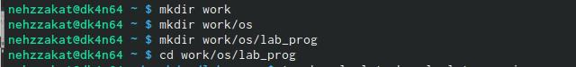

2. Создала в нём файлы: calculate.h, calculate.c, main.c.

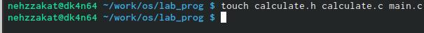

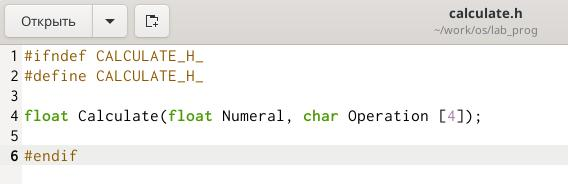

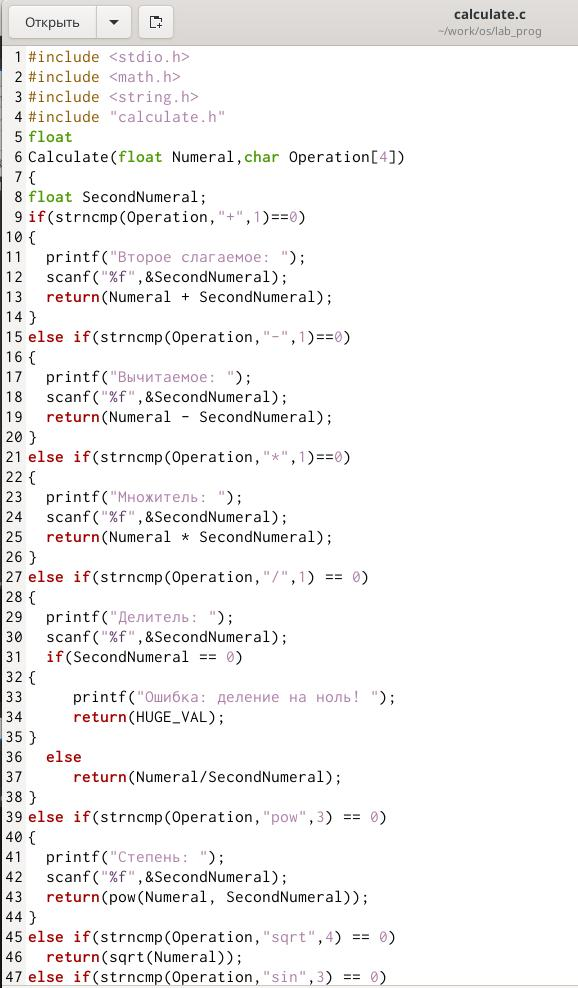

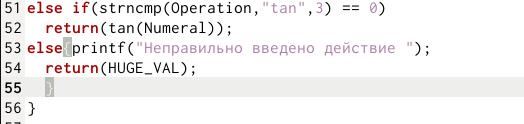

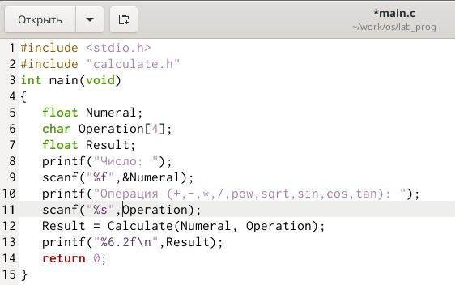

3. Выполнилаа компиляцию программы посредством gcc

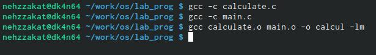

4. Исправила синтаксические ошибки в файле main.c (удалила & передала  operator в линии scanf("%s",&Operation);)

5. Создала Makefile со следующим содержанием

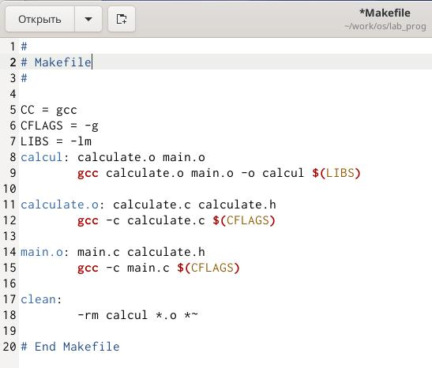

6.С помощью gdb выполнил отладку программы calcul (перед использованием gdb исправьте Makefile) 

- Запустил отладчик GDB, загружил в него программу для отладки: gdb ./calcul

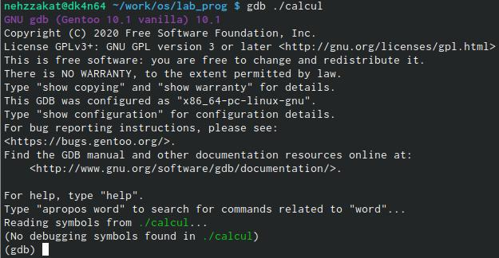

- Для запуска программы внутри отладчика ввел команду run: run

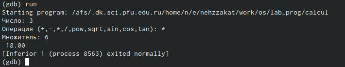

- Для постраничного (по 9 строк) просмотра исходного код использовал команду list:
list 

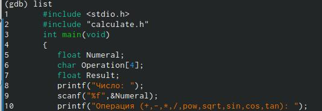

- Для просмотра строк с 12 по 15 основного файла использовал list с параметрами:
list 12,15

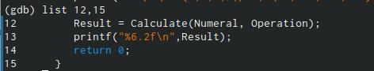

- Для просмотра определённых строк не основного файла использовал list с параметрами:
list calculate.c:20,29

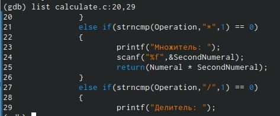

- Установила точку останова в файле calculate.c на строке номер 21:
list calculate.c:20,27
break 21

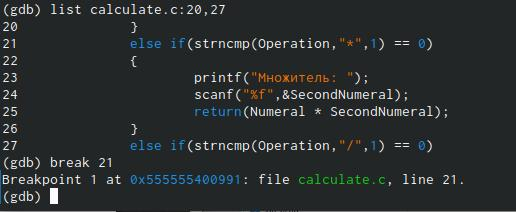

- Вывела информацию об имеющихся в проекте точка останова:
info breakpoints

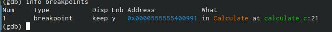

- Запустила программу внутри отладчика и убедитесь, что программа остановится в момент прохождения точки останова:
run
5
-
backtrace

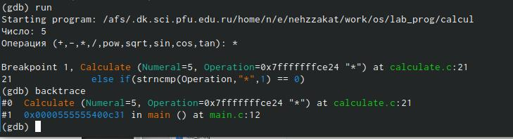

- Посмотрила, чему равно на этом этапе значение переменной Numeral, введя:
print Numeral

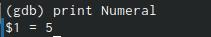

- Сравнила с результатом вывода на экран после использования команды:
display Numeral

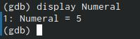

- Убрала точки останова:
info breakpoints
delete 1

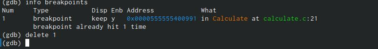

7. С помощью утилиты splint попробовала проанализировать коды файлов calculate.c и main.c.

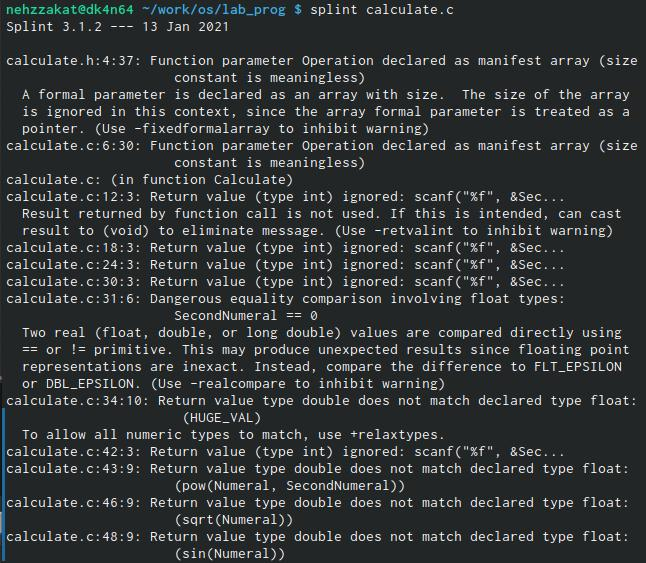

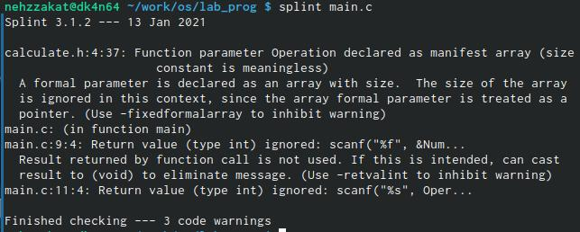

# Выводы

В результате работы , я приобрёла простейшие навыки разработки, анализа, тестирования и отладки приложений в Линукс

# Контрольные вопросы

1. Дополнительную информацию о этих программах можно получить с помощью функций info и man.

2. Unix поддерживает следующие основные этапы разработки приложений:

-создание исходного кода программы;

- представляется в виде файла;

-сохранение различных вариантов исходного текста;

-анализ исходного текста; Необходимо отслеживать изменения исходного кода, а также при работе более двух программистов над проектом программы нужно, чтобы они не делали изменений кода в одно время.

-компиляция исходного текста и построение исполняемого модуля;

-тестирование и отладка;

-проверка кода на наличие ошибок

-сохранение всех изменений, выполняемых при тестировании и отладке.

3. Использование суффикса ".с" для имени файла с программой на языке Си отражает удобное и полезное соглашение, принятое в ОС UNIX. Для любого имени входного файла суффикс определяет какая компиляция требуется. Суффиксы и префиксы указывают тип объекта. Одно из полезных свойств компилятора Си — его способность по суффиксам определять типы файлов. По суффиксу .c компилятор распознает, что файл abcd.c должен компилироваться, а по суффиксу .o, что файл abcd.о является объектным модулем и для получения исполняемой программы необходимо выполнить редактирование связей. Простейший пример командной строки для компиляции программы abcd.c и построения исполняемого модуля abcd имеет вид: gcc -o abcd abcd.c. Некоторые проекты предпочитают показывать префиксы в начале текста изменений для старых (old) и новых (new) файлов. Опция – prefix может быть использована для установки такого префикса. Плюс к этому команда bzr diff -p1 выводит префиксы в форме которая подходит для команды patch -p1.

4. Основное назначение компилятора с языка Си заключается в компиляции всей программы в целом и получении исполняемого модуля.

5. При разработке большой программы, состоящей из нескольких исходных файлов заголовков, приходится постоянно следить за файлами, которые требуют перекомпиляции после внесения изменений. Программа make освобождает пользователя от такой рутинной работы и служит для документирования взаимосвязей между файлами. Описание взаимосвязей и соответствующих действий хранится в так называемом make-файле, который по умолчанию имеет имя makefile или Makefile.

6. makefile для программы abcd.c мог бы иметь вид:

#

#

Makefile

#

CC = gcc

CFLAGS =

LIBS = -lm

calcul: calculate.o main.o

gcc calculate.o main.o -o calcul $(LIBS)

calculate.o: calculate.c calculate.h

gcc -c calculate.c $(CFLAGS)

main.o: main.c calculate.h

gcc -c main.c $(CFLAGS)

clean: -rm calcul *.o *~

 # End Makefile

В общем случае make-файл содержит последовательность записей (строк), определяющих зависимости между файлами. Первая строка записи представляет собой список целевых (зависимых) файлов, разделенных пробелами, за которыми следует двоеточие и список файлов, от которых зависят целевые. Текст, следующий за точкой с запятой, и все последующие строки, начинающиеся с литеры табуляции, являются командами OC UNIX, которые необходимо выполнить для обновления целевого файла. Таким образом, спецификация взаимосвязей имеет формат: target1 [ target2...]: [:] [dependment1...] [(tab)commands] [#commentary] [(tab)commands] [#commentary], где # — специфицирует начало комментария, так как содержимое строки, начиная с # и до конца строки, не будет обрабатываться командой make; : — последовательность команд ОС UNIX должна содержаться в одной строке make-файла (файла описаний), есть возможность переноса команд (\), но она считается как одна строка; :: — последовательность команд ОС UNIX может содержаться в нескольких последовательных строках файла описаний. Приведённый выше make-файл для программы abcd.c включает два способа компиляции и построения исполняемого модуля. Первый способ предусматривает обычную компиляцию с построением исполняемого модуля с именем abcd. Второй способ позволяет включать в исполняемый модуль testabcd возможность выполнить процесс отладки на уровне исходного текста.

7. Пошаговая отладка программ заключается в том, что выполняется один оператор программы и, затем контролируются те переменные, на которые должен был воздействовать данный оператор. Если в программе имеются уже отлаженные подпрограммы, то подпрограмму можно рассматривать, как один оператор программы и воспользоваться вторым способом отладки программ. Если в программе существует достаточно большой участок программы, уже отлаженный ранее, то его можно выполнить, не контролируя переменные, на которые он воздействует. Использование точек останова позволяет пропускать уже отлаженную часть программы. Точка останова устанавливается в местах, где необходимо проверить содержимое переменных или просто проконтролировать, передаётся ли управление данному оператору. Практически во всех отладчиках поддерживается это свойство (а также выполнение программы до курсора и выход из подпрограммы). Затем отладка программы продолжается в пошаговом режиме с контролем локальных и глобальных переменных, а также внутренних регистров микроконтроллера и напряжений на выводах этой микросхемы.

8. – backtrace – выводит весь путь к текущей точке останова, то есть названия всех функций, начиная от main(); иными словами, выводит весь стек функций;

– break – устанавливает точку останова; параметром может быть номер строки или название

функции;

– clear – удаляет все точки останова на текущем уровне стека (то есть в текущей функции);

– continue – продолжает выполнение программы от текущей точки до конца;

– delete – удаляет точку останова или контрольное выражение;

– display – добавляет выражение в список выражений, значения которых отображаются каждый раз при остановке программы;

– finish – выполняет программу до выхода из текущей функции; отображает возвращаемое значение,если такое имеется;

– info breakpoints – выводит список всех имеющихся точек останова;

– info watchpoints – выводит список всех имеющихся контрольных выражений;

– splist – выводит исходный код; в качестве параметра передаются название файла исходного кода, затем, через двоеточие, номер начальной и конечной строки;

– next – пошаговое выполнение программы, но, в отличие от команды step, не выполняет пошагово вызываемые функции;

– print – выводит значение какого-либо выражения (выражение передаётся в качестве параметра);

– run – запускает программу на выполнение;

– set – устанавливает новое значение переменной

– step – пошаговое выполнение программы;

– watch – устанавливает контрольное выражение, программа остановится, как только значение контрольного выражения изменится;

9. 1) Выполнили компиляцию программы 2)Увидели ошибки в программе 3) Открыли редактор и исправили программу 4) Загрузили программу в отладчик gdb 5) run — отладчик выполнил программу, мы ввели требуемые значения. 6) программа завершена, gdb не видит ошибок.

10. 1 и 2.) Мы действительно забыли закрыть комментарии; 3.) отладчику не понравился формат %s для &Operation, т.к %s — символьный формат, а значит необходим только Operation.

11. Если вы работаете с исходным кодом, который не вами разрабатывался, то назначение различных конструкций может быть не совсем понятным. Система разработки приложений UNIX предоставляет различные средства, повышающие понимание исходного кода. К ним относятся:

– cscope - исследование функций, содержащихся в программе;

– splint — критическая проверка программ, написанных на языке Си.

12. 
1. Проверка корректности задания аргументов всех исп

функций, а также типов возвращаемых ими значений;

2. Поиск фрагментов исходного текста, корректных с точки зрения синтаксиса языка Си, но малоэффективных с точки зрения их реализации или содержащих в себе семантические ошибки;

3. Общая оценка мобильности пользовательской программы.

