---
## Front matter
## Front matter
lang: ru-RU
title: Презентация по лабораторной работе № 14
author: |
	Эззакат Надиа 
institute: |
	Российский Университет Дужбы Народов
date: Москва, 2021

## Formatting
toc: false
slide_level: 2
theme: metropolis
header-includes: 
 - \metroset{progressbar=frametitle,sectionpage=progressbar,numbering=fraction}
 - '\makeatletter'
 - '\beamer@ignorenonframefalse'
 - '\makeatother'
aspectratio: 43
section-titles: true
---

# Цель работы

Приобрести простейшие навыки разработки, анализа, тестирования и отладки приложений в ОС типа UNIX/Linux на примере создания на языке программирования С калькулятора с простейшими функциями.

# Задание

1. В домашнем каталоге создайте подкаталог ~/work/os/lab_prog.

2. Создайте в нём файлы: calculate.h, calculate.c, main.c. Это будет примитивнейший калькулятор, способный складывать, вычитать, умножать и делить, возводить число в степень, брать квадратный корень, вычислять sin, cos, tan. При запуске он будет запрашивать первое число, операцию, второе число. После этого программа выведет результат и остановится.

3. Выполните компиляцию программы посредством gcc:
gcc -c calculate.c
gcc -c main.c
gcc calculate.o main.o -o calcul -lm

4. При необходимости исправьте синтаксические ошибки.

5. Создайте Makefile 

6. С помощью gdb выполните отладку программы calcul (перед использованием
gdb исправьте Makefile):
– Запустите отладчик GDB, загрузив в него программу для отладки:
gdb ./calcul

7. С помощью утилиты splint попробуйте проанализировать коды файлов calculate.c и main.c.

## Выполнение Работы

1. В домашнем каталоге создала подкаталог ~/work/os/lab_prog.

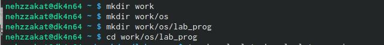

2. Создала в нём файлы: calculate.h, calculate.c, main.c.

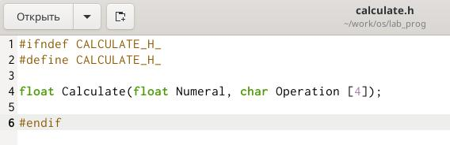

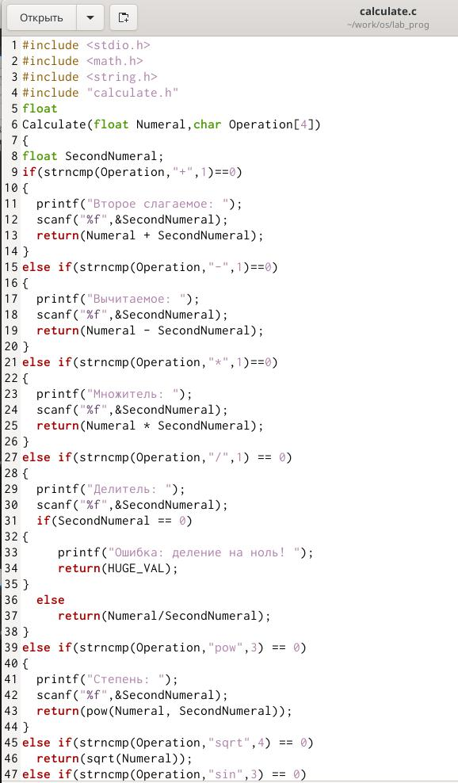

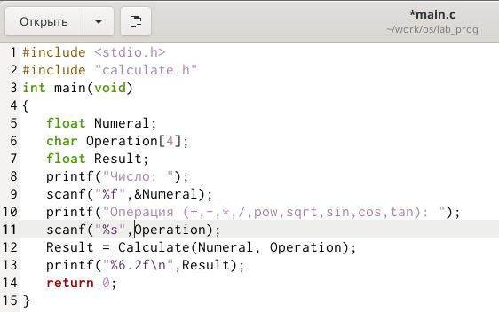

3. Выполнилаа компиляцию программы посредством gcc

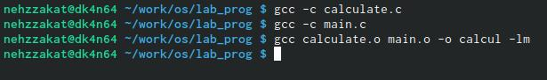

4. Исправила синтаксические ошибки в файле main.c (удалила & передала  operator в линии scanf("%s",&Operation);)

5. Создала Makefile 

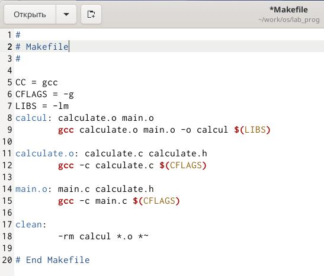

6. С помощью gdb выполнил отладку программы calcul, (перед использованием gdb исправьте Makefile)

- Запустила отладчик GDB, загружил в него программу для отладки: gdb ./calcul

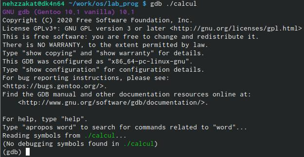

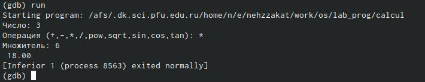

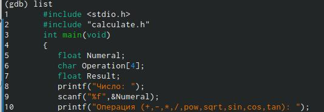

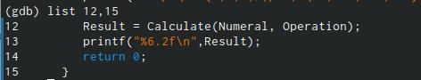

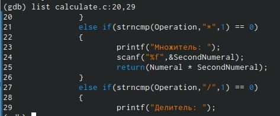

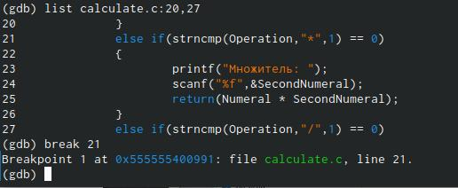

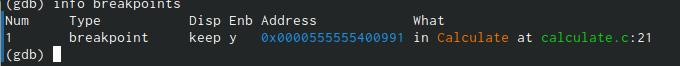

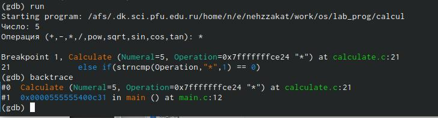

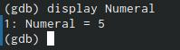

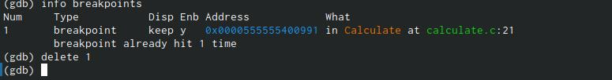

7. С помощью утилиты splint попробовала проанализировать коды файлов calculate.c и main.c.

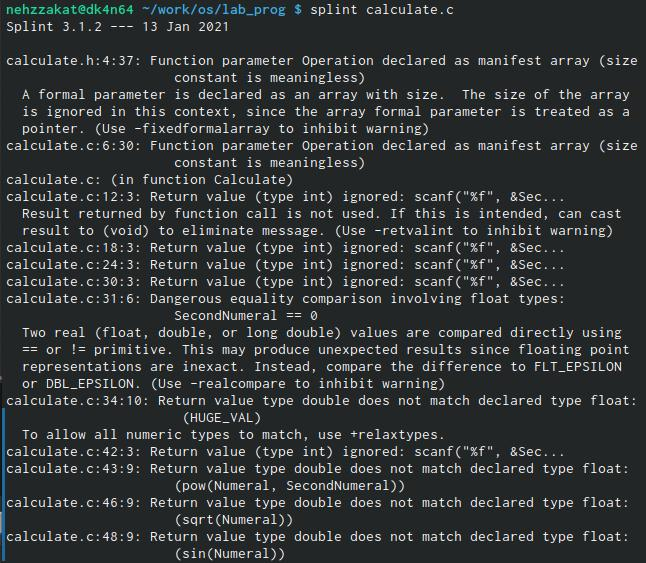

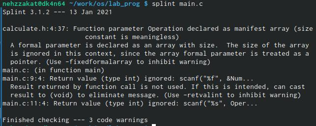
 
## Вывод

Я научился приобретать простейшие навыки разработки, анализа, тестирования и отладки приложений в таких ОС, как UNIX / Linux на примере создания калькулятора с простейшими функциями на языке программирования C. 

# Спасибо за внимание
